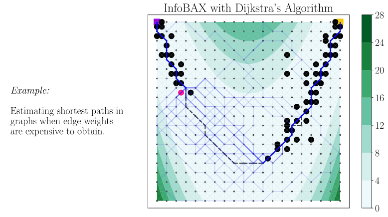
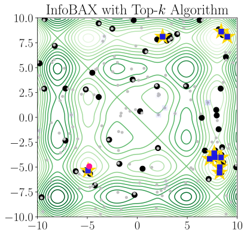

# Bayesian Algorithm Execution (BAX)

Code for the paper:

> [Bayesian Algorithm Execution: Estimating Computable Properties of Black-box Functions
> Using Mutual Information](https://arxiv.org/abs/2104.09460)\
> Willie Neiswanger, Ke Alexander Wang, Stefano Ermon\
> International Conference on Machine Learning (ICML), 2021\
> _arXiv:2104.09460_


### One-sentence summary
Extending Bayesian optimization from estimating global optima to
estimating other function properties defined by the output of algorithms.

### Abstract

In many real world problems, we want to infer some property of an expensive black-box
function f, given a budget of T function evaluations. One example is budget constrained
global optimization of f, for which Bayesian optimization is a popular method. Other
properties of interest include local optima, level sets, integrals, or graph-structured
information induced by f. Often, we can find an algorithm A to compute the desired
property, but it may require far more than T queries to execute. Given such an A, and a
prior distribution over f, we refer to the problem of inferring the output of A using T
evaluations as Bayesian Algorithm Execution (BAX).

To tackle this problem, we present a procedure, InfoBAX, that sequentially chooses
queries that maximize mutual information with respect to the algorithm's output.
Applying this to Dtra's algorithm, for instance, we infer shortest paths in synthetic
and real-world graphs with black-box edge costs.  Using evolution strategies, we yield
variants of Bayesian optimization that target local, rather than global, optima. On
these problems, InfoBAX uses up to 500 times fewer queries to f than required by the
original algorithm. Our method is closely connected to other Bayesian optimal
experimental design procedures such as entropy search methods and optimal sensor
placement using Gaussian processes.


## Installation

This repo requires Python 3.6+. To install Python dependencies, `cd` into this repo and
run:
```bash
$ pip install -r requirements/requirements.txt
$ pip install -r requirements/requirements_gpfs.txt
```
Note that this installs dependencies for
[GPflowSampling](https://github.com/j-wilson/GPflowSampling), which our implementation
uses to efficiently run algorithms on GP posterior function samples.

For some functionality, you'll also need to compile a [Stan](https://mc-stan.org/) model
by running:
```bash
$ python bax/models/stan/compile_models.py
```

## Examples

**[WIP]** More examples are in the process of being merged into this branch. Note that
the following API and functionality may undergo changes, as this library is still in the
early stages.

First make sure this repo directory is on the PYTHONPATH, e.g. by running:
```bash
$ source shell/add_pwd_to_pythonpath.sh
```

### Example 1: Estimating shortest paths in graphs

For a demo on a 10x10 grid graph, run:
```bash
$ python examples/dijkstra/bax_grid10_viz_simple_demo.py
```

To produce images for an animation on a 20x20 grid graph, run:
```bash
$ python examples/dijkstra/bax_grid20_animation.py
```

<p align="center">
    
</p>


### Example 2: Bayesian local optimization

For a demo on a two-dimensional optimization problem, run:
```bash
$ python examples/branin/bax_viz2d_simple_demo.py
```

<p align="center">
    &nbsp;
    
</p>


### Example 3: Top-k estimation

For a demo on a top-10 estimation task over a discrete set of points, run:
```bash
$ python examples/topk/bax_simple_demo.py
```

<p align="center">
    
</p>


## Citation
Please cite [our paper](https://arxiv.org/abs/2104.09460) if you find this project
helpful:
```
@inproceedings{neiswanger2021bayesian,
  title={Bayesian Algorithm Execution: Estimating Computable Properties of Black-box Functions Using Mutual Information},
  author={Neiswanger, Willie and Wang, Ke Alexander and Ermon, Stefano},
  booktitle={International Conference on Machine Learning},
  year={2021},
  organization={PMLR}
}
```
